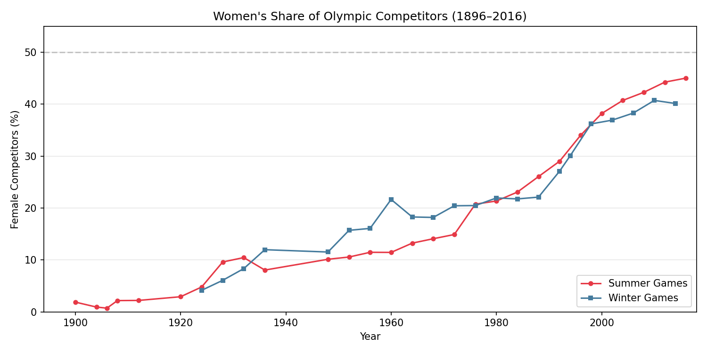
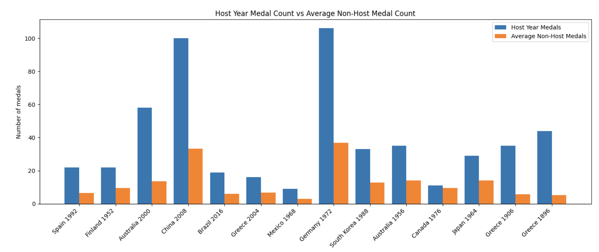

# Project Milestone 1

## 1. Dataset Description

Our dataset, *120 Years of Olympic History: Athletes and Results*, was scraped from Sports Reference in May 2018 and published on Kaggle. It covers every modern Olympic Games from Athens 1896 through Rio 2016. The dataset consists of two files:

**athlete_events.csv** (271,116 rows, 15 columns). Each row represents one athlete competing in one event at a particular Games. The columns are:

| Column | Type | Description |
|--------|------|-------------|
| ID | Integer | Unique identifier for each athlete |
| Name | String | Athlete's full name |
| Sex | String | M or F |
| Age | Float | Athlete's age (missing for 3.5% of rows) |
| Height | Float | Height in centimeters (missing for 22.2% of rows) |
| Weight | Float | Weight in kilograms (missing for 23.2% of rows) |
| Team | String | Team name (may differ from country, i.e. "Denmark/Sweden") |
| NOC | String | National Olympic Committee 3-letter code |
| Games | String | Year and season combined (e.g., "1992 Summer") |
| Year | Integer | Year of the Games (1896–2016) |
| Season | String | "Summer" or "Winter" |
| City | String | Host city |
| Sport | String | Sport category (66 unique sports) |
| Event | String | Specific event within the sport (765 unique events) |
| Medal | String | Gold, Silver, Bronze, or NA (didnt win a medal) |

**noc_regions.csv** (230 rows, 3 columns) maps each NOC code to a country/region name and includes notes for historical entities (e.g., "URS" maps to Russia, with a note "Soviet Union"; "GDR" maps to Germany, with a note for East Germany). This is essential because NOC codes alone are not human-readable, and several codes correspond to nations that no longer exist.

**Important notes about the data:**

- The unit of observation is an *athlete-event*, not an *athlete* or a *medal*. A single athlete who competes in five events at one Games appears as five rows. This means naive row counts overstate participation and medal totals for team sports.
- Height and Weight are missing for roughly one-fifth of entries, skewing toward earlier Games when these attributes were not systematically recorded. Any analysis of physical attributes must account for this survivorship in the data.
- The Winter and Summer Games were held in the same year until 1992. After 1992 they were staggered . Analyses over time must account for this structural change.
- Medal = NA means the athlete did not win a medal, not that the data is missing. Of the 271,116 entries, 39,783 (14.7%) are medal-winning performances.

## 2. Questions

### Question 1: How has women's participation in the Olympics evolved over time, and does the rate of growth differ across regions and sports?

Women were excluded from the 1896 Games entirely; by 2016 they made up ~45% of competitors. This aggregate trend likely masks variation,some sports admitted women decades before others, and cultural barriers may have slowed growth in certain regions. This matters to the IOC and national federations working toward gender parity: understanding where progress has been slowest helps direct funding and policy. The dataset records each competitor's sex, NOC, sport, and year, giving us everything needed to track these trends.

### Question 2: Does hosting the Olympic Games give a country a measurable home-field advantage in winning medals?

The tradition of hosting Olympic Games in different countries encourages residents of that country to attend the games, as well as increasing advertisements for athletes of that country as well. With the home crowd on their side, will athletes representing the country hosting the Olympics perform better or worse than they have in years prior? We decided to look at this by creating a bar chart that shows the host country's Olympic medal number in the year that they were hosting the Olympics in comparison to the average of the other years where they were not hosting the Olympics. We create a lookup table mapping city to country, then perform aggregate counts over the dataset for the number of medals won. 

### Question 3: Does height and weight metrics affect Winter and Summer Games atheletes differently?

### Question 4: Which countries have the widest distribution of medals across all events?

### Question 5: How does the season of the Olympics (Summer or Winter) influence medal patterns in different countries/teams?

### Question 6: How does the age distribution of Olympic athletes vary by sport and sex?

Some Olympic athletes begin their careers at a very young age, but there is a wide range in different ages that compete. Are there certain sports that have more of a certain age group competing that other sports? And does this change for different genders? This can show which sports have competitors that are only from a certain age range or have more flexibility. We will look at this by creating box plots for each sport and gender and comparing distributions.

### Question 7: On average, how many games (years not events) do athletes compete in by country?

## 3. Visualizations

### Visualization 1: Women's Share of Olympic Competitors Over Time (by Season)

**Description:** This line chart tracks the percentage of female competitors at each Olympic Games from 1896 to 2016, with separate lines for the Summer and Winter Games.

**Insight into Question 1:** The visualization reveals that women's participation was essentially zero before 1900, grew slowly through the mid-20th century, and then accelerated sharply from the 1970s onward, likely reflecting Title IX in the United States (1972), the IOC's push to add women's events, and broader societal shifts toward gender equity in sport. By 2016, the Summer Games approached 45% female participation. The Winter Games follow a broadly similar trajectory but with a notable lag, likely because Winter sports historically had fewer women's events. This visualization establishes the overall trend that Question 1 seeks to unpack further by region and sport.

## Visualization 2: 

**Description:** This bar chart compares the amount of medals won by countries when they are hosting the Olympics vs the average across other years when they are not. 

**Insight into Question 2:** This visualization reveals that countries typically win a lot more medals when they are hosting that year vs the other years when they are not hosting. This is likely due to the fact that when a country is hosting, athletes are fueled to impress the home crowd and may also have much more incentive to do well due to sponsorships. In addition, the host country may be able to choose judges or staff that could skew the results in favor of their country's athletes, though it is uncommon. 
