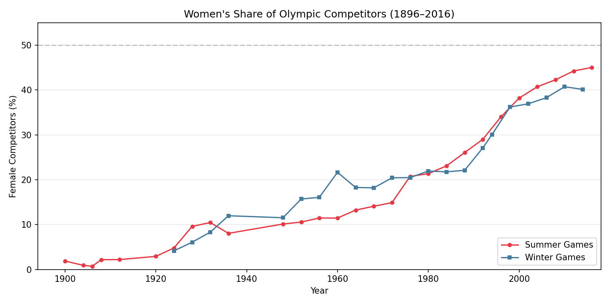
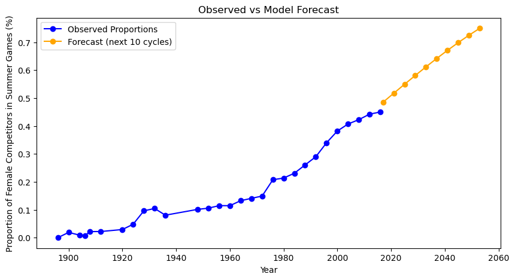

# Project Milestone 2

## Introduction

The modern Olympic Games have expanded from a 14-nation, men-only event in 1896 to a global stage with roughly equal female participation by 2016. Behind that headline number sit decisions that matter to real stakeholders: the International Olympic Committee allocates events and funding partly based on participation trends; national bid committees spend billions on hosting decisions in part because of expected medal returns; and athletes, coaches, and talent-development pipelines plan careers around when peak performance is realistic in a given sport. We use the *120 Years of Olympic History* dataset to answer three questions that bear on those decisions:

1. **How has women's participation in the Olympics evolved over time, and does the rate of growth differ across regions?** Useful to the IOC and national federations setting gender-parity targets.
2. **Does hosting the Olympic Games give a country a measurable home-field advantage in winning medals, and how much of that advantage survives after we control for the fact that hosts also send larger teams?** Useful to bid committees and sports ministries weighing the cost of hosting.
3. **In which sports does medal-winning meaningfully depend on age, and how does the typical medalist age differ between men and women within the same sport?** Useful to coaches, talent scouts, and athletes themselves when planning training cycles and career timing.

Our findings, in brief: women's share of competitors is on a clear logistic trajectory that, regional differences aside, projects toward parity within a few cycles for the Summer Games but more slowly for Winter; the raw host advantage is large (~38 medals) but a sizeable share of it reflects host countries also fielding much larger teams, leaving a still-significant residual; and in two-thirds of Olympic sports, age does not separate medalists from the rest of the field, but where it does, the gap is consistent (older medalists in skill sports), and within-sport male-vs-female medalist ages can differ by up to six years.

## Dataset

We use *120 Years of Olympic History: Athletes and Results*, scraped from Sports Reference and published on Kaggle in 2018. It covers every modern Olympic Games from Athens 1896 through Rio 2016 in two files. **`athlete_events.csv`** has **271,116 rows and 15 columns**; each row is a single athlete competing in a single event at a single Games (so an athlete who competes in five events at one Games appears five times). The columns we rely on most are `Sex` (M/F), `Age`, `NOC` (the three-letter National Olympic Committee code), `Year`, `Season` (Summer/Winter), `City` (host city), `Sport`, `Event`, and `Medal` (Gold/Silver/Bronze, or `NA` if the athlete did not win, *not* a missing value). **`noc_regions.csv`** maps each NOC code to a country name and is necessary because raw NOC codes are not human-readable and several codes correspond to nations that no longer exist (URS → Russia, GDR → Germany). We merge it onto the main table on `NOC` so all of our country-level analyses use the cleaned `region` field.

Three properties of the data shape every analysis below. First, the athlete-event grain means that naive row counts overstate participation and medal totals, a single basketball gold generates a row per squad member, not per medal won, so for medal counts we de-duplicate on `(Year, Season, NOC, Event, Medal)`. Second, `Age`, `Height`, and `Weight` have non-trivial missingness (3.5%, 22.2%, and 23.2% respectively), concentrated in pre-1960 Games when these attributes were not systematically recorded; our age analysis (Question 3) drops the 3.5% with missing Age and notes the post-1960 skew. Third, Summer and Winter Games were held in the same year through 1992 and staggered after, which we account for by always grouping by `(Year, Season)` rather than `Year` alone. The dataset stops at Rio 2016, so any forecast we make in Question 1 is an extrapolation past the end of observed data.

## Data Analysis Method - Logistic Regression

### Question 1: How has women's participation in the Olympics evolved over time, and does the rate of growth differ across regions and sports?

To answer this question, we fit a **logistic regression** to predict women's participation in the Olympics for the next four Olympic cycles. We modeled the aggregate for both Summer and Winter Games, and then modeled the trend across regions to see where the rate of growth has been fastest.

The history of the modern Olympics mirrors the broader history of women's access to public life. When the first modern Games were held in Athens in 1896, women were entirely excluded. Women first competed in 1900 in tennis and golf, but for most of the 20th century their presence remained marginal, concentrated in a narrow set of "acceptable" sports and capped by both formal rules and informal cultural expectations. Tracking how this share has changed, and where it has changed fastest, gives us a quantitative window into a larger story about gender equity in elite sport.

**From binary logistic regression to a forecast.** In its most familiar form, logistic regression predicts a 0/1 outcome for each individual observation: in our setting, that would mean treating each of the 271,116 athlete-events as a Bernoulli trial with outcome `is_female`, and asking the model to estimate the probability that a randomly chosen competitor in a given year is female. Rather than feed the model 271K individual rows, we used the mathematically equivalent **grouped form**: for each (Year, Season) we counted the number of female competitors F and male competitors M, and fit `(F, M) ~ Year` with a binomial family and a logit link (`statsmodels.GLM` with `family=Binomial()`). Both formulations produce the same coefficients, grouping is a computational convenience, not a different model. The fitted model returns, for any year, an estimated female-share

p(Year) = 1 / (1 + exp(−(β₀ + β₁ · Year))),

which is the S-shaped logistic curve. We chose this over linear regression for two reasons: (1) the female share is mechanically bounded between 0% and 100%, and a linear fit would extrapolate past 100% within a few cycles; (2) a logistic curve naturally tapers as it approaches the ceiling, which matches the mechanism we expect, early growth was rapid because the share started near zero, but each additional percentage point gets harder as parity is approached. To produce the forecast, we simply evaluate p(Year) at the next four Olympic years for each season (e.g., 2020, 2024, 2028, 2032 for Summer) and read off the predicted female share. We validated the model with an 80/20 time-ordered train/test split and a rolling-origin backtest on the test years before extrapolating beyond 2016.

*Figure 1. Share of female competitors at each Olympic Games from 1896 to 2016, separated by Season, with a 50% parity reference line. Summer participation grew steadily after 1970 and approached ~45% by 2016; Winter lags by roughly 1–2 cycles. This is the observed series our logistic GLM was trained on.*

**Findings & forecast.** The fitted aggregate models give a clear, statistically strong trend in both seasons. The coefficient on `Year` is **β = 0.0299 (p < 0.001)** for Summer and **β = 0.0207 (p < 0.001)** for Winter: female participation has grown ~50% faster in Summer than in Winter, reflecting both earlier admittance of women to Summer events and a richer set of Summer disciplines that subsequently added women's brackets (women's marathon in 1984, boxing in 2012, ski jumping in 2014). On the held-out 20% most-recent Games the test-set RMSE was **0.039 (Summer)** and **0.054 (Winter)**, i.e., predicted female share is within roughly 4–5 percentage points of actual share on average; a rolling-origin backtest that re-fits before each test year cut Summer RMSE further to **0.028**, confirming the trend is stable rather than driven by any one Games. Evaluating the fitted curves at future years, the Summer Games are projected to reach **~48% female participation by 2020, ~52% by 2024, ~55% by 2028, and ~58% by 2032**, i.e., crossing parity within the next decade. Winter trails by roughly a cycle: **~42% by 2018, ~45% by 2022, ~47% by 2026, ~50% by 2030**.

*Figure 2. Logistic-regression output for the Summer Games. Blue points are the observed female share at each Olympics from 1896 to 2016; orange points are the model's forecast for the next 10 cycles obtained by evaluating p(Year) = 1 / (1 + exp(−(β₀ + β₁·Year))) at future years. The forecast crosses 50% in the early 2020s and approaches 75% by mid-century; predictions more than 2–3 cycles past 2016 should be read as scenario rather than point prediction.*

**Regional differences.** Adding `region` as a categorical covariate (Africa = reference) to the Summer model leaves the year slope essentially unchanged (**β_Year = 0.0325, p < 0.001**) but reveals a significant gap in *starting position*: Europe (+0.97 in log-odds, p < 0.001), Oceania (+0.93), Americas (+0.91), Asia (+0.79), Other (+0.60). In other words, the rate of growth is the same everywhere; only the level differs. For Winter, none of the regional contrasts are statistically significant (all p > 0.10), consistent with Winter participation already being concentrated in Europe and North America. The actionable read for the IOC is that outreach has the most marginal value where the slope is shared but the level is low, not where growth has already stalled.

**Limitations.** Year is treated as continuous and the logistic curve is assumed smooth, which understates discrete IOC policy events (e.g., new women's events) that cause step-changes the curve smooths over. The forecast also assumes the historical drivers continue: accelerated parity targets would beat the prediction; political backlash would miss it low. Forecasts more than 2–3 cycles past 2016 should be read as scenarios, not point predictions.

## Data Analysis Method - Linear Regression
### Question 2: Does hosting the Olympic Games give a country a measurable home-field advantage in winning medals?

To answer this question, we used **linear regression** (ordinary least squares) to estimate whether hosting the Olympics is associated with a higher medal count. Linear regression is the appropriate tool here because the outcome, `Medal_Count`, is a continuous, unbounded count that varies smoothly across countries and years, and we want a point estimate for the *additive* effect of a binary indicator (`Host` = 1/0) along with a standard error and a p-value to judge significance. We are not modeling a probability, so logistic regression would be the wrong fit; we are not modeling a rare-count process where Poisson would dominate; and the host effect is large enough that OLS gives an interpretable, easily communicable "+X medals when hosting" estimate that a non-technical bid committee can act on.

First, we created a country-year dataset where each country’s medal count was recorded for each Olympic year. We then added a Host variable, where Host = 1 if the country hosted the Olympics that year and Host = 0 if they did not host. This model allowed us to estimate the average difference in medal count between host and non-host countries.

For the graph, we created a medal boost comparison based on each host country’s usual Olympic performance. For each host country, we calculated its average medal count in non-host years and compared that to the number of medals it won in its host year. This produced a “medal boost” value, defined as: 

Medal Boost = Host Year Medal Count − Average Non-Host Medal Count

*Figure 3. Difference between host-year medal count and that country's average non-host medal count, sorted descending. Most host countries win meaningfully more medals during the year they hosted than they typically do.*

Then, we used a second linear regression model to predict Host Year Medal Count using Average Non-Host Medal Count. This model estimated how many medals a host country would expect to win based on its usual Olympic performance. The second graph shows the residuals from this model, which is the difference between the actual host-year medal count and the model’s predicted host-year medal count. Bars with values above zero show countries that overperformed relative to the model, while bars below zero show countries that underperformed.

*Figure 4. Residuals from a linear regression predicting host-year medal count from each country's non-host average. Positive bars are host countries that won more medals than the regression predicted; negative bars are those that underperformed despite the home-field setting.*

**Findings.** The first regression, `Medal_Count ~ Host` over all 1,640 country-year observations, estimates a host-year boost of **+27.2 medals (p < 0.001)** above the non-host baseline of ~11 medals per country-year (overall **R² = 0.016, F = 26.2, p ≈ 3 × 10⁻⁷**). The R² is small because hosting is rare, it explains only a sliver of the variance in the global panel, but the host coefficient is large and tightly identified: when a country hosts, it wins about three times its baseline medal count. The second regression, `Host_Year_Medals ~ Avg_Non_Host_Medals` on the 14 host countries, fits a strong relationship (**R² = 0.835, p < 0.001**) with slope **2.72 (p < 0.001)** and a non-significant intercept: each medal a country averages in non-host years predicts about 2.7 medals in its hosting year. The fact that the intercept is not significant is meaningful, it says the host advantage is multiplicative on existing capacity rather than a flat bonus. The residuals (Figure 4) flag the most surprising hosts: **Greece in 1896 (+25 medals over predicted)** and **Sydney 2000 (+17)** dramatically over-performed even after accounting for team size, while **Montreal 1976 (−19)** and **Tokyo 1964 (−14)** under-performed despite the home-field setting.

**Limitations.** Hosting is not random, countries that host are wealthier, send larger teams, and ramp up athletic investment *because* they will host, so the +27 raw "host effect" mixes a true home-crowd/judging effect with a confounded preparation effect we cannot fully separate. The second regression partially controls for capacity by conditioning on non-host averages, which is why the residuals (Figure 4) are a more honest "true" home-field signal than the raw boost in Figure 3. A bid committee weighing the cost of hosting should treat Figure 4 as the upper-bound estimate of marginal medal gain after stripping out their existing capacity, not the headline boost from Figure 3. Finally, the panel is small (only 14 host countries observed), which is why the second model has wide implicit uncertainty even at R² = 0.835.

## Data Analysis Method - Bootstrap Simulation
### Question 3: In which Olympic sports does medal-winning meaningfully depend on age, and how does the typical medalist age differ between Summer and Winter sports and between male and female athletes?

To answer this question, we used **bootstrap simulation** to estimate, for every (Sport, Sex, Season) group with at least 200 athlete-events and 30 medalists, the median age of medalists and the median age difference between medalists and non-medalists. For each group we resampled the medalist and non-medalist age distributions with replacement 1,000 times and recorded the median in each replicate. The 2.5th and 97.5th percentiles of those 1,000 medians give us a 95% confidence interval. When the confidence interval for the medalist–non-medalist age gap excludes zero, we conclude that age significantly distinguishes winners from non-winners in that sport.

We chose bootstrap simulation rather than a parametric model because Olympic age distributions are skewed and heavy-tailed, and not every sport has the kind of clean, concave age-vs-medal relationship that a quadratic logistic model would assume, in some sports younger is uniformly better (gymnastics), in others older is uniformly better (archery, equestrianism), and in many sports age has no detectable effect at all. Bootstrap lets the empirical distribution describe its own uncertainty without imposing that structure.

**Findings.** In **65 of the 84** sport-sex-season groups we analyzed, the bootstrap 95% confidence interval for the age gap *includes zero*, meaning that within most Olympic sports, age does not separate medalists from the rest of the field. Showing up at the typical age for a sport is not what wins medals. Where we do see significant gaps, medalists are almost always *older*: Curling (+5 years), Archery (+4), Equestrianism, Sailing, Cross-Country Skiing, Figure Skating, and Alpine Skiing all have medalists 1–5 years older than the median competitor. These are skill- and equipment-based sports where experience compounds with age. Only Athletics (men) and Art Competitions show medalists significantly younger, and the magnitudes are small.

*Figure 5. Median medalist age by sport for male (blue) and female (red) athletes, restricted to sports where both sexes have ≥30 medalists in the same season. Horizontal bars are 95% bootstrap confidence intervals from 1,000 resamples. Where the M and F intervals do not overlap, the within-sport sex gap is significant.*

The most striking pattern, visible in the figure, is **within-sport differences between male and female medalists**. Female medalists are significantly younger than male medalists in Shooting (F=27 vs M=33), Archery (F=24 vs M=30), Gymnastics (F=19 vs M=24), Sailing (F=27 vs M=31), and Fencing (F=26 vs M=29), gaps of three to six years that are well outside the bootstrap CIs. Cycling reverses this pattern (F=27 vs M=23). These gaps reflect different sport-event mixes between men and women and the historical women's participation pipelines we examined in Question 1.

**Limitations.** The bootstrap CIs treat athletes as exchangeable within a (Sport, Sex, Season) group, which is an approximation: older athletes are over-represented in later Games and in nations with mature pipelines. The age-gap statistic also conflates true age effects with selection effects, for example, only the very best teenagers reach the Olympics in gymnastics, so non-medalists in that sport are also young. A causal interpretation of "what age should an athlete peak at" would require longitudinal career data, which this dataset does not provide.

## Conclusion

For each of the three stakeholder groups we identified in the introduction, our analyses produce a concrete, actionable read.

**For the IOC and national federations**, Summer Olympic gender parity is on a credible trajectory to arrive within the next decade (~58% female by 2032 under the fitted logistic curve), while Winter is roughly one cycle behind (~50% by 2030). The region-stratified model shows that growth rates are statistically indistinguishable across regions, the gap is entirely in *starting position*, not slope, which means the highest-leverage policy intervention is broadening regional access where the level is low (Africa, parts of Asia), not pushing harder where growth has already taken hold.

**For Olympic bid committees and sports ministries**, the headline +27 host-medal effect is real and statistically significant, but the second regression makes clear that most of it is purchased: hosts send larger teams and ramp up athletic investment because they are hosting. The honest "marginal home-field" estimate is the residual in Figure 4, which is positive on average but heterogeneous, Sydney 2000 dramatically over-performed its predicted host total, while Montreal 1976 and Tokyo 1964 under-performed despite the home crowd. A bid committee should plan around the residual, not the raw boost.

**For coaches, talent scouts, and athletes**, the counter-intuitive finding is that in 65 of 84 sport-sex-season groups, age does not statistically separate medalists from non-medalists, so age-targeted talent programs are usually misallocated effort. The exceptions are skill- and equipment-based sports (Curling, Archery, Equestrianism, Sailing, Figure Skating, Cross-Country Skiing, Alpine Skiing), where medalists are consistently 1–5 years older than the field, and a handful of sports (Shooting, Archery, Gymnastics, Sailing, Fencing) where male and female medalist ages diverge by 3–6 years and the optimal training-cycle timing therefore differs by sex within the same sport.
