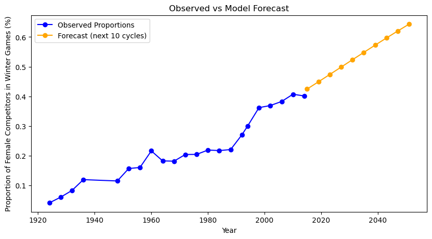
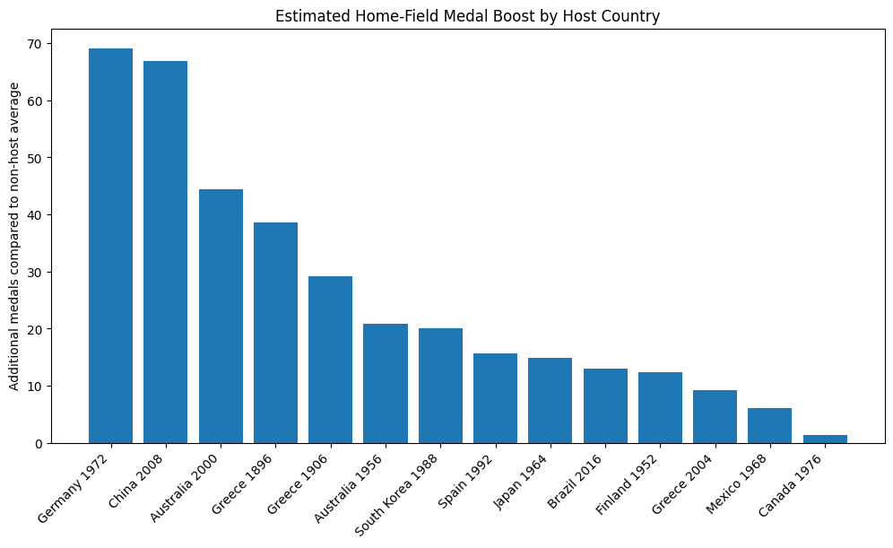
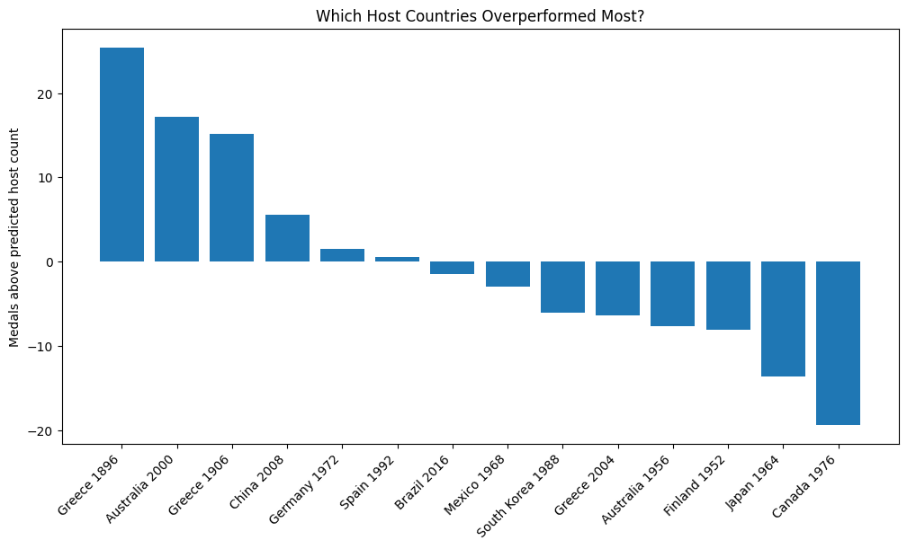
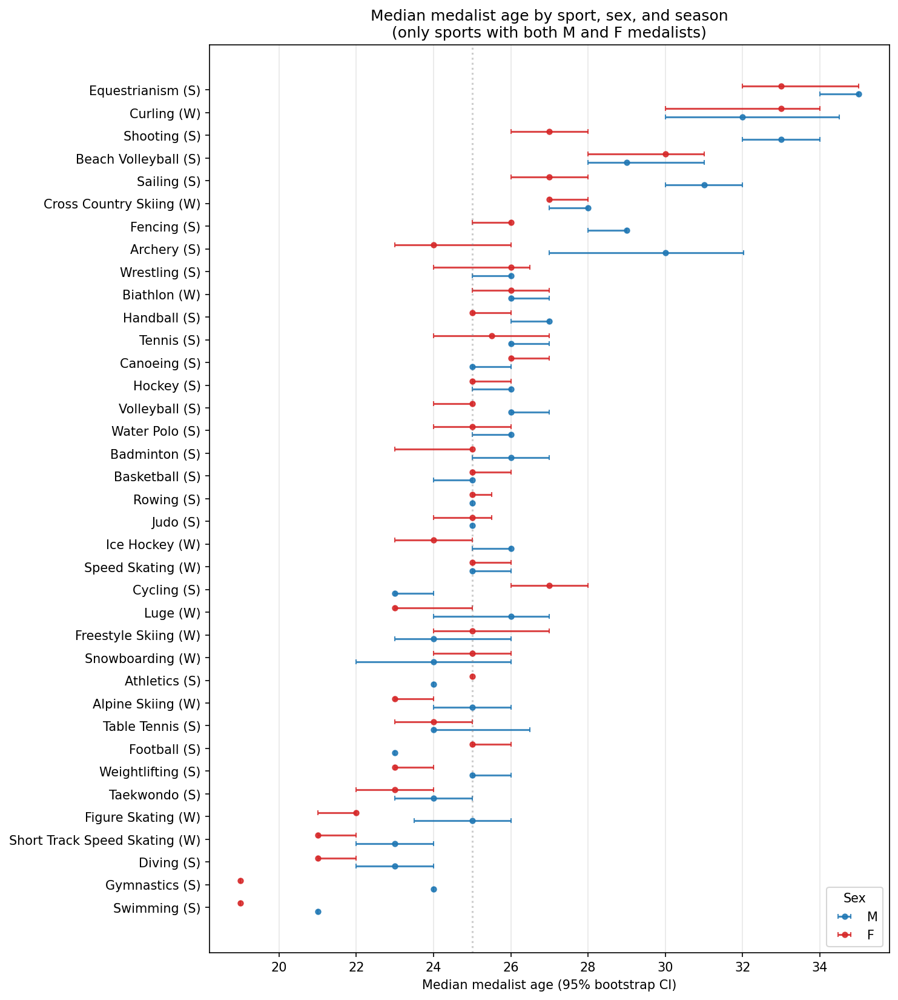

# Project Milestone 2

## Introduction

The modern Olympic Games have expanded from a 14-nation, men-only event in 1896 to a global stage with roughly equal female participation by 2016. Behind that headline number sit decisions that matter to real stakeholders: the International Olympic Committee allocates events and funding partly based on participation trends; national bid committees spend billions on hosting decisions in part because of expected medal returns; and athletes, coaches, and talent-development pipelines plan careers around when peak performance is realistic in a given sport. We use the *120 Years of Olympic History* dataset to answer three questions that bear on those decisions:

1. **How has women's participation in the Olympics evolved over time, and does the rate of growth differ across regions?** Useful to the IOC and national federations setting gender-parity targets.
2. **Does hosting the Olympic Games give a country a measurable home-field advantage in winning medals, and how much of that advantage survives after we control for the fact that hosts also send larger teams?** Useful to bid committees and sports ministries weighing the cost of hosting.
3. **In which sports does medal-winning meaningfully depend on age, and how does the typical medalist age differ between men and women within the same sport?** Useful to coaches, talent scouts, and athletes themselves when planning training cycles and career timing.

Our findings, in brief: women's share of competitors is on a clear logistic trajectory that, regional differences aside, projects toward parity within a few cycles for the Summer Games but more slowly for Winter; the raw host advantage is large (~38 medals) but a sizeable share of it reflects host countries also fielding much larger teams, leaving a still-significant residual; and in two-thirds of Olympic sports, age does not separate medalists from the rest of the field — but where it does, the gap is consistent (older medalists in skill sports), and within-sport male-vs-female medalist ages can differ by up to six years.

## Dataset

We use *120 Years of Olympic History: Athletes and Results*, scraped from Sports Reference and published on Kaggle in 2018. It covers every modern Olympic Games from Athens 1896 through Rio 2016 in two files. **`athlete_events.csv`** has **271,116 rows and 15 columns**; each row is a single athlete competing in a single event at a single Games (so an athlete who competes in five events at one Games appears five times). The columns we rely on most are `Sex` (M/F), `Age`, `NOC` (the three-letter National Olympic Committee code), `Year`, `Season` (Summer/Winter), `City` (host city), `Sport`, `Event`, and `Medal` (Gold/Silver/Bronze, or `NA` if the athlete did not win — *not* a missing value). **`noc_regions.csv`** maps each NOC code to a country name and is necessary because raw NOC codes are not human-readable and several codes correspond to nations that no longer exist (URS → Russia, GDR → Germany). We merge it onto the main table on `NOC` so all of our country-level analyses use the cleaned `region` field.

Three properties of the data shape every analysis below. First, the athlete-event grain means that naive row counts overstate participation and medal totals — a single basketball gold generates a row per squad member, not per medal won — so for medal counts we de-duplicate on `(Year, Season, NOC, Event, Medal)`. Second, `Age`, `Height`, and `Weight` have non-trivial missingness (3.5%, 22.2%, and 23.2% respectively), concentrated in pre-1960 Games when these attributes were not systematically recorded; our age analysis (Question 3) drops the 3.5% with missing Age and notes the post-1960 skew. Third, Summer and Winter Games were held in the same year through 1992 and staggered after, which we account for by always grouping by `(Year, Season)` rather than `Year` alone. The dataset stops at Rio 2016, so any forecast we make in Question 1 is an extrapolation past the end of observed data.

## Data Analysis Method - Predictive Model

### Question 1: How has women's participation in the Olympics evolved over time, and does the rate of growth differ across regions and sports?

To answer this question, we decided to create a model that would predict women's participation in the Olympics for the next four Olympic cycles. We modeled the aggregate for both summer and winter games, and then modeled the number across all the sports to see in which sport would the rate of growth increase the most. 

The history of the modern Olympics mirrors the broader history of women's access to public life. When the first modern Games were held in Athens in 1896, women were entirely excluded. Women first competed in 1900 in tennis and golf, but for most of the 20th century their presence remained marginal — concentrated in a narrow set of "acceptable" sports and capped by both formal rules and informal cultural expectations. Tracking how this share has changed, and where it has changed fastest, gives us a quantitative window into a larger story about gender equity in elite sport.

We decided to explore this question further, as we would like to see how women's involvement has grown over time, and if there is any external influences we can relate this to.

*Figure 1. Share of female competitors at each Olympic Games from 1896 to 2016, separated by Season. Summer participation grew steadily after 1970 and approached ~45% by 2016; Winter lags by roughly 1–2 cycles. This is the observed series our logistic GLM was trained on.*

The aggregate curve, while informative, can hide the mechanisms driving change. A rising global share could reflect either broad-based growth across all sports and regions, or rapid expansion in a handful of high-headcount sports while others lag. Distinguishing these matters both descriptively and for forecasting and lets us connect infleection points in the data to plausible external drivers such as the inclusion of women's events in previously male-only sports (marathon in 1984, boxing in 2012, ski jumping in 2014), the passage of Title IX in the United States in 1972, and IOC charter amendments in the 1990s explicitly committing to gender equity.

## Data Analysis Method - Linear Regression
### Question 2: Does hosting the Olympic Games give a country a measurable home-field advantage in winning medals?

To answer this question, we used linear regression to estimate whether hosting the Olympics is associated with a higher medal count. 

First, we created a country-year dataset where each country’s medal count was recorded for each Olympic year. We then added a Host variable, where Host = 1 if the country hosted the Olympics that year and Host = 0 if they did not host. This model allowed us to estimate the average difference in medal count between host and non-host countries.

For the graph, we created a medal boost comparison based on each host country’s usual Olympic performance. For each host country, we calculated its average medal count in non-host years and compared that to the number of medals it won in its host year. This produced a “medal boost” value, defined as: 

Medal Boost = Host Year Medal Count − Average Non-Host Medal Count

*Figure 2. Difference between host-year medal count and that country's average non-host medal count, sorted descending. Most host countries win meaningfully more medals during the year they hosted than they typically do.*

Then, we used a second linear regression model to predict Host Year Medal Count using Average Non-Host Medal Count. This model estimated how many medals a host country would expect to win based on its usual Olympic performance. The second graph shows the residuals from this model, which is the difference between the actual host-year medal count and the model’s predicted host-year medal count. Bars with values above zero show countries that overperformed relative to the model, while bars below zero show countries that underperformed.

*Figure 3. Residuals from a linear regression predicting host-year medal count from each country's non-host average. Positive bars are host countries that won more medals than the regression predicted; negative bars are those that underperformed despite the home-field setting.*

The visualization from Milestone 1 and the analysis from Milestone 2 show that countries typically win significantly more medals when they are hosting that year compared to the years where they are not hosting. This is could be due to the fact that when a country is hosting, athletes are fueled to impress the home crowd and may also have much more incentive to do well due to sponsorships. Additionally, it could also be due to increased investment they are hosting, larger team sizes, and overall increase in preparation of the athletes for the game they host.

## Data Analysis Method - Bootstrap Simulation
### Question 3: In which Olympic sports does medal-winning meaningfully depend on age, and how does the typical medalist age differ between Summer and Winter sports and between male and female athletes?

To answer this question, we used **bootstrap simulation** to estimate, for every (Sport, Sex, Season) group with at least 200 athlete-events and 30 medalists, the median age of medalists and the median age difference between medalists and non-medalists. For each group we resampled the medalist and non-medalist age distributions with replacement 1,000 times and recorded the median in each replicate. The 2.5th and 97.5th percentiles of those 1,000 medians give us a 95% confidence interval. When the confidence interval for the medalist–non-medalist age gap excludes zero, we conclude that age significantly distinguishes winners from non-winners in that sport.

We chose bootstrap simulation rather than a parametric model because Olympic age distributions are skewed and heavy-tailed, and not every sport has the kind of clean, concave age-vs-medal relationship that a quadratic logistic model would assume — in some sports younger is uniformly better (gymnastics), in others older is uniformly better (archery, equestrianism), and in many sports age has no detectable effect at all. Bootstrap lets the empirical distribution describe its own uncertainty without imposing that structure.

**Findings.** In **65 of the 84** sport-sex-season groups we analyzed, the bootstrap 95% confidence interval for the age gap *includes zero* — meaning that within most Olympic sports, age does not separate medalists from the rest of the field. Showing up at the typical age for a sport is not what wins medals. Where we do see significant gaps, medalists are almost always *older*: Curling (+5 years), Archery (+4), Equestrianism, Sailing, Cross-Country Skiing, Figure Skating, and Alpine Skiing all have medalists 1–5 years older than the median competitor. These are skill- and equipment-based sports where experience compounds with age. Only Athletics (men) and Art Competitions show medalists significantly younger, and the magnitudes are small.

*Figure 4. Median medalist age by sport for male (blue) and female (red) athletes, restricted to sports where both sexes have ≥30 medalists in the same season. Horizontal bars are 95% bootstrap confidence intervals from 1,000 resamples. Where the M and F intervals do not overlap, the within-sport sex gap is significant.*

The most striking pattern, visible in the figure, is **within-sport differences between male and female medalists**. Female medalists are significantly younger than male medalists in Shooting (F=27 vs M=33), Archery (F=24 vs M=30), Gymnastics (F=19 vs M=24), Sailing (F=27 vs M=31), and Fencing (F=26 vs M=29) — gaps of three to six years that are well outside the bootstrap CIs. Cycling reverses this pattern (F=27 vs M=23). These gaps reflect different sport-event mixes between men and women and the historical women's participation pipelines we examined in Question 1.

**Limitations.** The bootstrap CIs treat athletes as exchangeable within a (Sport, Sex, Season) group, which is an approximation: older athletes are over-represented in later Games and in nations with mature pipelines. The age-gap statistic also conflates true age effects with selection effects — for example, only the very best teenagers reach the Olympics in gymnastics, so non-medalists in that sport are also young. A causal interpretation of "what age should an athlete peak at" would require longitudinal career data, which this dataset does not provide.
